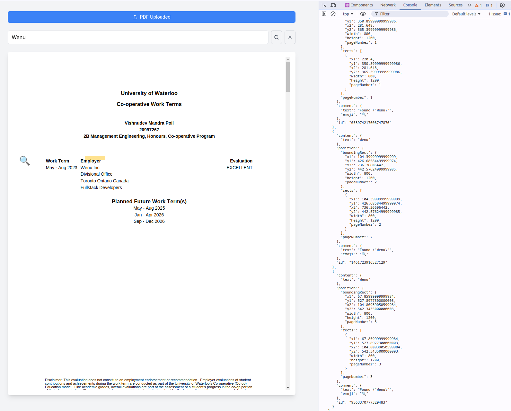

# Adanomad Online Assessment

## Project Overview

This project is a PDF viewer and keyword search application developed as part of the Adanomad Tech Consulting Challenge. It allows users to upload PDF documents, view them in a web browser, search for keywords, and highlight matching text.

## Features

- PDF document upload and display
- Page navigation (next, previous, jump to specific page)
- Zoom in/out functionality
- Document information display (total pages, current page)
- Keyword search across the entire PDF
- Text highlighting for search matches
- Sidebar for search results and navigation
- Responsive design for various screen sizes

## Technologies Used

- Next.js
- React 
- TypeScript
- react-pdf library for PDF rendering
- Tailwind CSS for styling
- Custom highlight storage solution

## Getting Started

1. Clone the repository
2. Install dependencies: `pnpm install`
3. Run the development server: `pnpm run dev`
4. Open [http://localhost:3000](http://localhost:3000) in your browser

## Project Structure

```
.
├── app
│   ├── components
│   │   ├── App.tsx
│   │   ├── Button.tsx
│   │   ├── HighlightPopup.tsx
│   │   ├── Input.tsx
│   │   ├── KeywordSearch.tsx
│   │   ├── PdfUploader.tsx
│   │   ├── PdfViewer.tsx
│   │   ├── Sidebar.tsx
│   │   └── Spinner.tsx
│   ├── favicon.ico
│   ├── globals.css
│   ├── layout.js
│   ├── page.js
│   ├── styles
│   │   ├── output.css
│   │   └── styles.css
│   └── utils
│       ├── highlightStorage.ts
│       └── pdfUtils.ts
├── public
│   ├── sample.pdf
│   └── ...
├── scripts
│   └── comment-file-path.sh
├── README.md
├── screenshot.png
└── ...
```

- `app/page.js`: Main entry point of the application
- `app/components/`: React components for various parts of the application
- `app/utils/`: Utility functions for PDF processing and highlight storage
- `app/styles/`: CSS files for styling

## Key Components

- `App.tsx`: Core application component
- `PdfViewer.tsx`: Handles PDF rendering and navigation
- `KeywordSearch.tsx`: Manages keyword search functionality
- `HighlightPopup.tsx`: Displays information about highlighted text
- `Sidebar.tsx`: Shows search results and navigation options

## Screenshot



*The screenshot above shows the main interface of the PDF viewer application, including the document display, search functionality, and sidebar.*

## Future Improvements

- Implement annotation tools (e.g., freehand drawing, text notes)
- Add support for multiple document comparison
- Enhance mobile responsiveness for better small-screen experience
- Implement user authentication and document permissions
- Optimize performance for large PDF files

## Contributing

Contributions, issues, and feature requests are welcome. Feel free to check [issues page](https://github.com/yourusername/your-repo-name/issues) if you want to contribute.

## License

[MIT License](https://opensource.org/licenses/MIT)

## Acknowledgements

- [react-pdf](https://github.com/wojtekmaj/react-pdf) for PDF rendering capabilities
- [Tailwind CSS](https://tailwindcss.com/) for utility-first CSS framework
- [Next.js](https://nextjs.org/) for the React framework
